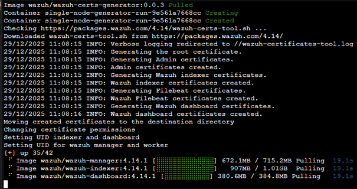
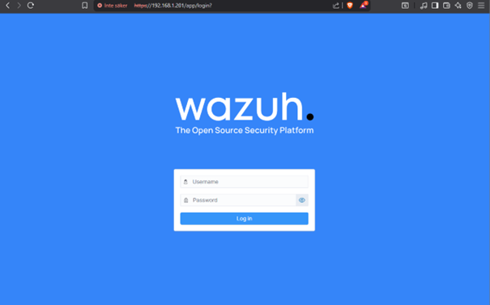
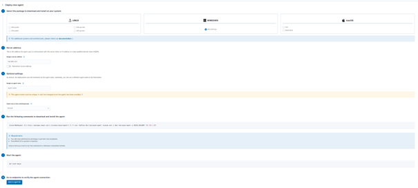
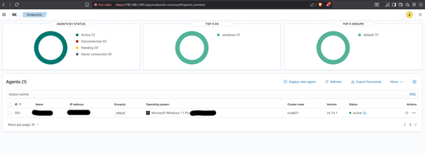
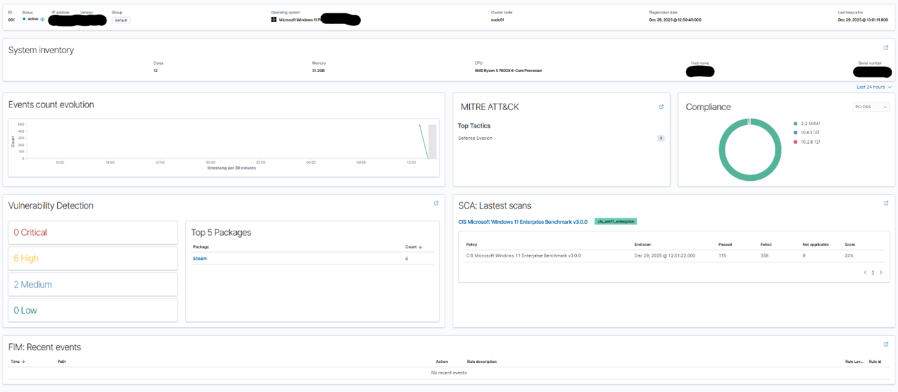
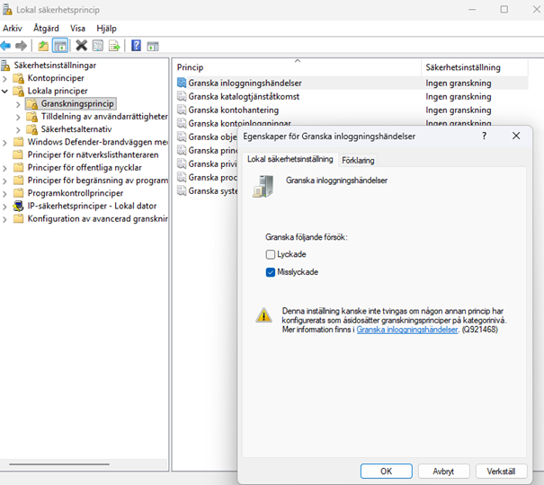
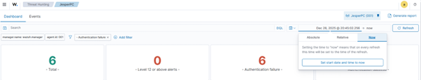
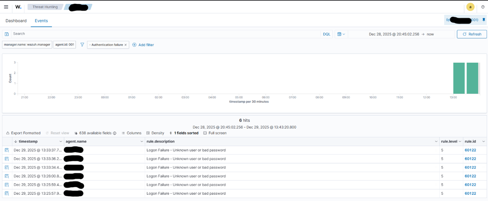

# 🕵🏼 Wazuh SIEM on Proxmox LXC

This project documents the complete installation and configuration of a Wazuh SIEM server running in a Proxmox LXC container using Docker. It covers everything from creating the container to deploying a Windows agent and configuring Audit Policies for threat detection.

## 1. 🧊 Create the LXC Container
*I am using Proxmox VE 9.1.2.*

1.  Click on **Create CT** to bring up the config window.
2.  **General:**
    * **Hostname:** `Wazuh-Server` (or your preferred name).
    * **Unprivileged container:** Checked ✅
    * **Nesting:** Checked ✅
3.  **Template:** Choose `Ubuntu 24.04-standard` (or 22.04). If missing, download it via *Templates -> Download*.
4.  **Disks:** Choose your storage location. Set disk size to at least **50 GiB** (logs take space).
5.  **CPU:** Allocate cores. I am using **2 cores** (running on an i5-8500T).
6.  **Memory:** I allocated **4096 MiB** (4GB) out of my available 24GB.
7.  **Network:**
    * IPv4: Static IP (e.g., `192.168.1.201/24`).
    * Gateway: Your router IP.
    * IPv6: Static or SLAAC.
8.  **DNS:** Use `8.8.8.8` and `1.1.1.1`.
9.  Confirm and finish.

## 2. 📶 Start & Verify Network
Start the container via the UI or shell:
```bash
pct start 101
pct enter 101
```

Verify connectivity by pinging Google:
```bash
ping -c 3 google.com
```
You should see a response like `64 bytes from...`.

## 3. 🐳 Install Docker
Update the system and install Docker inside the container:

```bash
apt update && apt upgrade -y
apt install curl git -y
curl -fsSL https://get.docker.com -o get-docker.sh
sh get-docker.sh
```

Verify installation:
```bash
docker --version
```
It should return something like `Docker version 29.1.3`.

## 4. 👁️‍🗨️ Install Wazuh (Docker)

### 🚨Host Modification (Important!)🚨
Before running Wazuh, you must increase the memory mapping limit on the **Proxmox Host** (not the container).
Run this in the Proxmox Shell:
```bash
sysctl -w vm.max_map_count=262144
echo "vm.max_map_count=262144" >> /etc/sysctl.conf
```
Reboot the container (`pct reboot 101`).

### Download and Run
Enter the container again and run:
```bash
git clone https://github.com/wazuh/wazuh-docker.git -b v4.14.1
cd wazuh-docker/single-node
docker compose -f generate-indexer-certs.yml run --rm generator
docker compose up -d
```



### 🩺 LXC Troubleshooting (Required)
If the containers fail to start, you must edit `docker-compose.yml` to remove limits that LXC doesn't support.

1.  `nano docker-compose.yml`
2.  **Remove** the entire `ulimits` section (memlock, soft, hard).
3.  Under `environment`, update the Java memory and disable memory locking:
    ```yaml
    - "OPENSEARCH_JAVA_OPTS=-Xms512m -Xmx512m"
    - "bootstrap.memory_lock=false"
    ```
    *(This prevents Wazuh from trying to lock memory, which fails in LXC)*.

Restart the stack:
```bash
docker compose down
docker compose up -d
```

## 5. 🌐 Web Interface Access
Open your browser and navigate to `https://192.168.1.201` (or your IP). Accept the certificate warning.
* **User:** `admin`
* **Password:** `SecretPassword`



## 6. 🪟 Deploying a Windows Agent
1.  Click **"Deploy new agent"**.
2.  Select **Windows**.
3.  Enter the Server IP (`192.168.1.201`).



4.  Copy the generated command and run it in **PowerShell (Admin)** on the Windows PC.
5.  Start the service:
    ```powershell
    NET START Wazuh
    ```

### Verification
Go to **Agents Summary**. You should now see **Active: (1)**.



Click on the agent to see the specific dashboard for that computer.



## 7. 🛑 Detecting Logon Failures (Simulation)
To test the system, we will simulate an attack.
1.  Lock your Windows PC.
2.  Type the wrong a few times.
3.  Log in correctly.

### Configuring Windows Audit Policy
By default, Windows might not log failed attempts. To fix this:
1.  Run `secpol.msc`.
2.  Go to **Local Policies -> Audit Policy**.
3.  Open **Audit logon events**.
4.  Check **Failure** and apply.



### Viewing the Events
If events are not showing up in Wazuh, check the time filter in the **Threat Hunting** tab.
Change the time from "Absolute" to **"Now"** to see live events.



You should now see a list of **Logon Failure** events (Event ID 4625).




**🎉Congratulations! You now have a functional SIEM.🎉**
